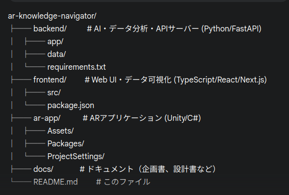

# AR空間における三次元データ可視化とAIによる分析支援に関する研究

## 1. 概要 (Abstract)

本研究は、専門知識を持たないユーザーでも直感的かつ効率的にデータ分析を行うことを可能にする、新しい支援ツールの開発を目的とする。現代では、多くの分野でデータ活用が不可欠となっているが、その分析プロセスは専門知識への依存度が高く、多くの人々にとって大きな障壁となっている。また、従来の2Dグラフによる可視化では、多次元的なデータが持つ複雑な構造を直感的に理解することが困難である。

この課題を解決するため、本研究では以下の3つの技術を統合したプロトタイプシステムを開発する。

1.  **AIによる分析支援:** ユーザーがアップロードしたデータに対し、AIが統計的な分析や可視化手法の提案を行う。
2.  **ARによる三次元可視化:** 分析結果をAR（拡張現実）空間に立体的に投影し、直感的なデータ理解を促進する。
3.  **ARコラボレーション:** AR空間を共有することで、遠隔地のユーザー同士が同じデータを囲んで議論し、意思決定を行うことを可能にする。

これにより、データ分析の参入障壁を下げ、教育やビジネスの現場におけるデータに基づいたコミュニケーションと意思決定の質を向上させることを目指す。

## 2. システム構成 (System Architecture)

本システムは、以下の3つのコンポーネントが連携して動作するクライアントサーバーモデルを採用している。

1.  **バックエンド (APIサーバー)**
    * 役割: データ分析、AIによる推論、WebSocketを介したリアルタイム通信の管理。
    * 技術: Python, FastAPI
2.  **フロントエンド (Webアプリケーション)**
    * 役割: ユーザーインターフェースの提供、データアップロード、分析結果の表示。
    * 技術: TypeScript, React (Next.js)
3.  **ARクライアント (ARアプリケーション)**
    * 役割: バックエンドから受け取ったデータをAR空間にレンダリングする。
    * 技術: Unity, C#, XREAL SDK

## 3. ディレクトリ構成 (Directory Structure)

本プロジェクトはモノレポ形式で管理されており、主要なディレクトリ構成は以下の通り。

## 4. 使用技術 (Technology Stack)

| 領域 | 主要技術 |
| :--- | :--- |
| **バックエンド** | Python 3.10+, FastAPI, Uvicorn, Pandas, Scikit-learn, Gemini API |
| **フロントエンド**| Node.js 18+, TypeScript, React 18, Next.js 14, Three.js, D3.js |
| **AR** | Unity 2022.3 (LTS), C#, XREAL SDK |
| **その他** | Git, Docker (推奨) |

## 5. セットアップ手順 (Installation & Setup)

本プロジェクトをローカル環境で実行するための手順は以下の通り。

### 前提条件

-   Gitがインストールされていること
-   Python 3.10以降がインストールされていること
-   Node.js 18以降 (npm含む) がインストールされていること
-   Unity Hub および Unity 2022.3 (LTS) がインストールされていること

### 6. リポジトリのクローン

### 7.開発手順

【ステップ1】バックエンド：APIの基礎構築

【ステップ2】フロントエンド：Web UIとバックエンドの接続

【ステップ3】バックエンド：AI分析機能の実装

【ステップ4】フロントエンド：分析結果の2D可視化

【ステップ5】ARクライアント：基礎構築とバックエンドとの接続

【ステップ6】ARクライアント：AR空間での3Dデータ可視化

【ステップ7】リアルタイム通信：ARコラボレーション機能の実装

【ステップ8】統合と仕上げ